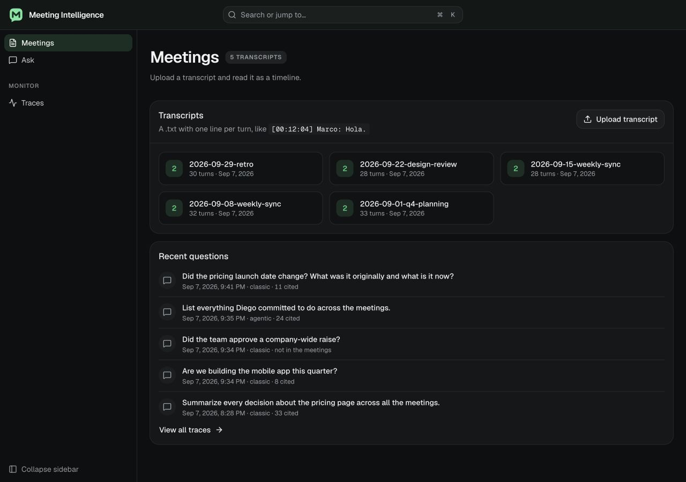
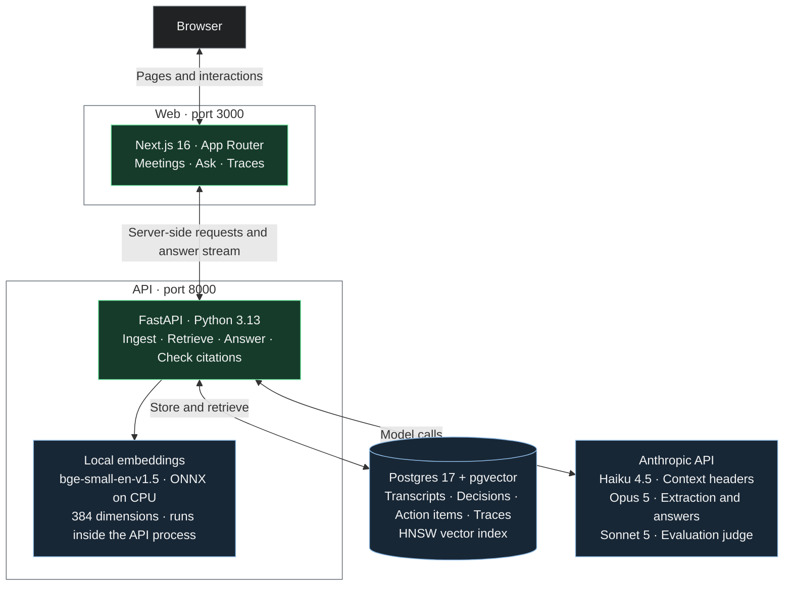
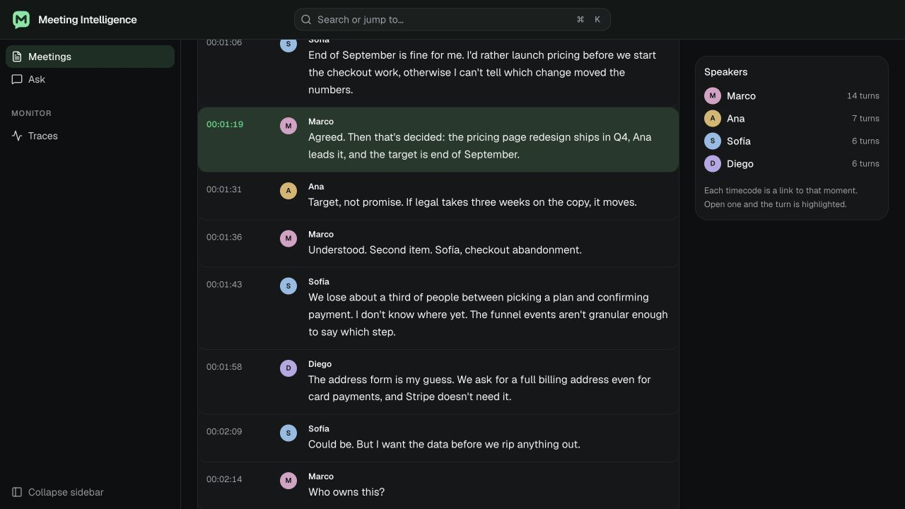
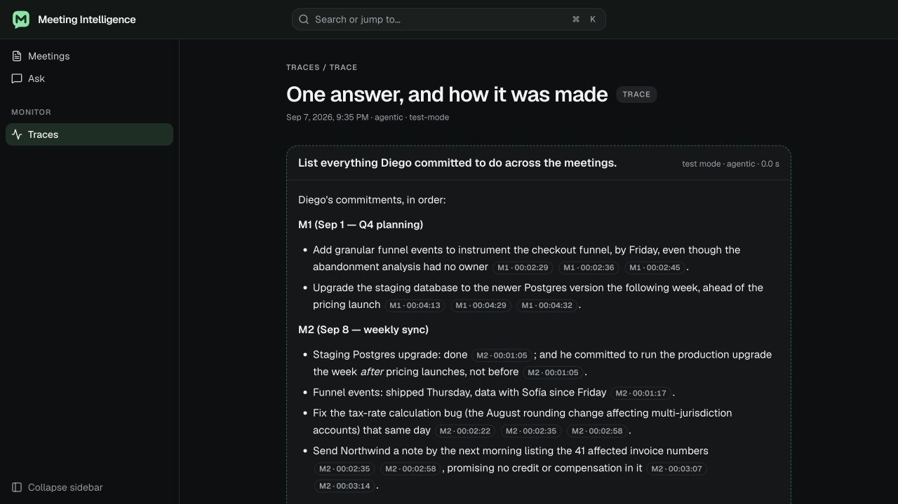
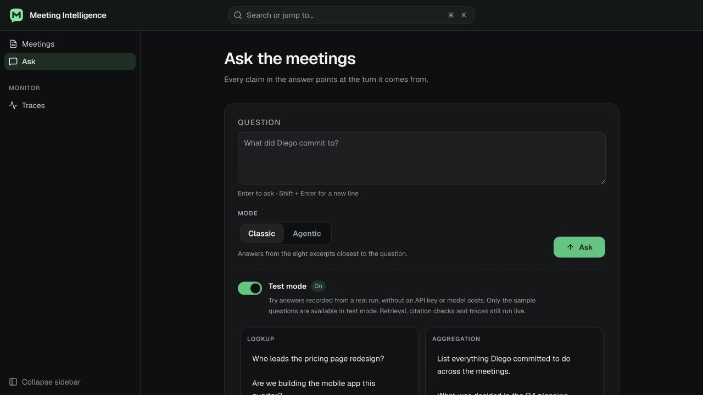
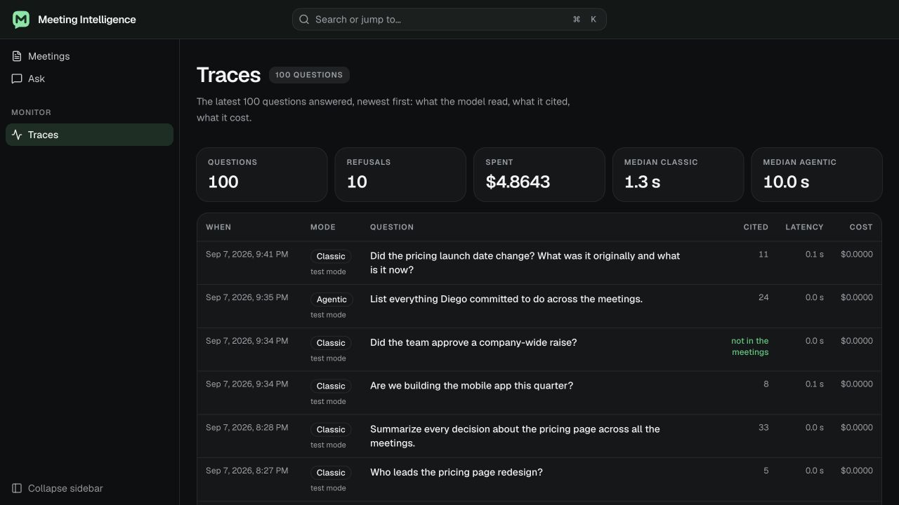

# Meeting Intelligence

[](web/)
[](api/)
[](#2-architecture-overview)
[](#4-rag-and-llm-approach-and-decisions)
[](#1-quick-setup)

This is a challenge requested by an important company that wanted me to create a 
system that can load meeting transcripts and find key facts, and also ask questions
about them.

Once I was doing it, I was also checking Anthropic documentation, where I found a [pretty
interesting article](https://docs.claude-mem.ai/progressive-disclosure) about 2 ways of creating RAG: the classical mode, but also 
the progressive disclosure way.

I added the two to the platform, so you can use the traditional RAG with chunking, embeddings, retrieval, etc,
but also the agent checking an index and going through the ones that are found most important

Of course, everything here is measured, and you can check the evals in this document.



[Explore the screens](#what-you-get) · [Quick setup](#1-quick-setup) · [Architecture](#2-architecture-overview)

## 1. Quick setup

You need Docker, Python 3.13 with [uv](https://docs.astral.sh/uv/), Node 20 or
newer, and an Anthropic API key. The key is optional: without one, test mode
replays a recorded run (see the end of this section).

1. Start Postgres with pgvector:

   ```bash
   docker compose up -d db
   ```

2. Configure the API. Copy `api/.env.example` to `api/.env` and put your key
   in `ANTHROPIC_API_KEY`. Then start it:

   ```bash
   cd api && uv sync && uv run uvicorn app.main:app --port 8000
   ```

   The first request downloads a small embedding model (ONNX, runs on CPU).

3. Load the five sample meetings:

   ```bash
   scripts/seed.sh
   ```

   Without a key, skip this step. The Meetings page has a button that loads
   the same five transcripts from the recorded run.

4. Start the web app:

   ```bash
   cd web && npm install && npm run dev
   ```

5. Open http://localhost:3000.

Without the key, uploads and live questions answer 503 with a message that
says what is missing, and the app offers test mode instead. The Meetings page
loads the five sample meetings from a recorded run, and the Ask page has a
Test mode switch, on by default when the API has no key, that replays the
answers Claude gave to the 23 golden questions. Nothing is spent. With a key,
the same switch shows the recorded answers for free. On the sample corpus a
live question costs between three and eleven cents; the traces page shows
the exact figure for each one.

To check the install, run `uv run pytest` in `api/` and `npm test` in `web/`.
Neither needs a key; the API's storage tests use the database from step 1.
The eval commands are under [Tests and evaluation](#tests-and-evaluation).

## 2. Architecture overview

Two services, one database and one external API. Everything about AI lives
in Python; TypeScript owns pixels. The web app could be replaced by a CLI
without touching retrieval.



The browser only talks to Next.js. The API is the only service with database
access; embeddings run locally inside that same Python process.


The web service owns the pages and nothing else. Uploads and questions go
through a Next route handler that forwards to the API, reads happen in
server components, and the answer arrives as server-sent events that the
handler passes through without buffering; the last event carries the
citations and a trace id.

The API owns parsing, chunking, context headers, embeddings, extraction,
retrieval, answering, the citation check, traces and the eval, and it is the
only process that talks to Postgres. Every model-backed piece (header writer,
extractor, answerer, agent, embedder) sits behind a small interface, which is
what lets the tests run without a key and lets test mode replay a recording
through the same pipeline.

One Postgres holds both the vectors and the structured rows, so a search can
filter by meeting in the same query and an extracted row can point at the
turn it came from with a foreign key. Six tables: meetings, turns, chunks
(text, context header, embedding), decisions, action_items and traces. That
turn column is what makes a citation checkable instead of decorative.

The two paths through it, ingest and answer, are walked step by step under
[How it works](#how-it-works).

## 3. Production, scale and a hyperscaler

Right now the application runs locally. To put it in production, I would
package the web and the API with Docker and run them on a cloud like AWS,
using a managed Postgres database with pgvector.

For bigger transcripts and more users, I would process uploads in background
jobs, so people don't have to wait for everything inside one request. I would
also filter the agent's index by team and date, instead of sending all the
meetings every time.

Before opening it to users, I would add login, keep each team's data separate,
and set up backups and a proper place for secrets. We already track the cost
of each answer, but I would also add usage limits, retries for failed jobs,
and alerts when something goes wrong.

## 4. RAG and LLM approach and decisions

I added two ways of answering questions. The classic mode finds the eight
closest chunks using embeddings and sends them to the model. The agentic
mode first reads an index of the meetings, then chooses which parts to read
before answering. This is useful when a question needs information from
several meetings, like finding everything someone committed to do.

For chunking, I kept complete speaker turns, so we don't lose who said what.
I also added a short context description to each chunk and extracted the
decisions and action items, keeping a reference to the original turn.

I used Opus 5 for extraction and answers, Haiku 4.5 for the context
descriptions, and Sonnet 5 to evaluate the results. Embeddings run locally
with bge-small-en-v1.5, and Postgres with pgvector stores both the vectors and
the meeting data. I used the Anthropic SDK directly because the pipeline
was small enough to write without another framework.

The model is asked to cite its sources and say when the meetings don't have
an answer. The code checks that each citation points to a turn the model
actually received. I also tested both modes with the same 23 questions and
saved the results, so I could compare answer quality, speed and cost.
Every answer has a trace where you can see what was read and what it cost.

## 5. Key technical decisions and why

I separated the application into Next.js for the interface and FastAPI for
the AI work. For the database, I used plain SQL because there are only six
tables and I wanted the retrieval queries to be easy to follow.

I kept both answer modes so I could compare them. One thing I tried was
adding the extracted decisions directly to the classic prompt, but the
answers became less faithful to their citations. So I kept that index for
the agent to find relevant turns, which it has to read before citing them.

I put citations next to each claim and made them clickable, so you can check
the original transcript. I also added test mode with recorded answers from
real runs, so someone can try the application without an API key. Those
answers are marked as recorded, while retrieval and citation checks still run.

There are a few things I would revisit. The chunk size is around 500 tokens,
but I haven't compared different sizes yet. Tool calls appear as they happen,
but the answer text arrives when it is complete. I also changed one evaluation
label after reviewing the results: the CFO's name was missing, but the model
could still explain where that person was mentioned. That change is recorded
in the design doc.

## 6. Engineering standards

I wrote tests for the API and the interface, using fake model responses so
most tests can run without an API key. Database tests use a separate Postgres
database, so they don't touch the development data.

I used Pydantic and TypeScript to check the data moving between components,
and added validation for citations, extracted facts and tool arguments.
Each upload is saved in one transaction, and errors return a message to the
user. I also kept the evaluation runs and a design log in the repository.

With the time available, I left CI, Python linting and type checking,
service Dockerfiles, authentication and rate limits for later. The web tests
cover components and routes, but there is no automated browser test suite yet.

## 7. How I used AI tools

I built this with Claude Code, and it did most of the typing. My part was the
direction: the stack and the timebox, the sign-off on the two-layer design,
the decision to build both answer modes and compare them, the brief for the
sample meetings and the sign-off on the golden questions, and the review of
every slice before I committed it. The agentic mode came from a page in
Anthropic's docs on progressive disclosure that I brought into the session.
The assistant wrote the code test-first, a failing test and then the code
that passes it, ran the evals, and drafted this README and the design doc,
which I reviewed. The launch configuration under `.claude/` is the one it
used to start both services and look at the pages in a browser while it
worked. The golden set records its own provenance in the file: questions,
answers and key facts drafted with the assistant from the transcripts, then
reviewed by hand, with every expected turn checked against the transcripts
by a test.

Two rules held throughout: the API key never passed through the assistant,
and nothing was committed that I hadn't reviewed. The eval exists partly
because of this setup. When a tool writes most of the code, a judge that
scores the output is a better way to know whether a change helped than
reading diffs.

## What you get

These screenshots use the five fictional sample meetings. Recorded answers
are marked as test mode, and trace totals come from the local demo history.

**Meetings.** Upload a transcript and read it as a timeline, with speakers
and clickable timestamps.



*Go straight to the original moment.*

**Ask.** Choose Classic or Agentic mode and get an answer with citations
you can open and check.



*Check the source behind each claim.*

**Test mode.** Try sample questions without an API key. Answers are recorded,
but retrieval and citation checks still run.



*Try it without model costs.*

**Traces.** See what each answer read, how long it took and what it cost.
Open a trace for the full details.



*Review each run.*

**API.** Upload meetings, ask questions and read traces through FastAPI.
Interactive endpoint documentation is available at `/docs`.

## How it works

When you upload a transcript, the application splits it into speaker turns
and groups them into chunks. It adds a short context description, creates
embeddings, and extracts decisions and action items. After checking the
extracted data, it saves everything in Postgres.

When you ask a question, classic mode retrieves the eight closest chunks.
Agentic mode reads the meeting index and uses tools to find the turns it
needs, with a limit of five rounds. Both modes then produce an answer with
citations that the code checks against the turns the model received.

Each answer also saves a trace, so you can see what was read, which tools
ran, how long it took and what it cost. I kept the detailed design and the
decision log in [docs/design.md](docs/design.md).

## What the numbers say

I tested the same 23 questions twice for each version, using Sonnet 5 as the
judge. Each pair of numbers below shows the two runs. Faithfulness measures
whether the claims in an answer are supported by the cited turns, and is
only scored on questions the system answered.

| | Classic | Agentic, first prompt | Agentic, citing rule |
| --- | --- | --- | --- |
| Completeness | 94 / 94% | 94 / 96% | 90 / 93% |
| Faithfulness | 89 / 82% | 59 / 72% | 88 / 89% |
| Expected turns cited | 93 / 93% | 90 / 91% | 90 / 90% |
| "What did Diego commit to?" | 0.78 | 0.89 / 1.00 | 1.00 / 1.00 |
| Mean latency | 7.5 / 7.1 s | 10.9 / 11.0 s | 10.8 / 11.2 s |
| Cost per run | $1.06 / 1.05 | $1.21 / 1.09 | $1.21 / 1.10 |

Classic was faster and worked well for lookups. Agentic did better on the
question about all of Diego's commitments, where it needed to read several
meetings. The cost was fairly close between the two.

The first agentic prompt often cited the wrong turn. After I added a rule
to cite every turn used in a claim, faithfulness improved from 59 / 72% to
88 / 89%. Completeness dropped a little, so it wasn't an improvement in
every metric.

I would still be careful with small differences: the judge sometimes changed
its score for the same answer, and regenerating chunk descriptions also
changed retrieval results. The saved runs are in [eval-runs/](eval-runs/INDEX.md).

## Tests and evaluation

```bash
cd api && uv run pytest
```

```bash
cd web && npm test
```

Storage and API tests need the database from Compose and use a sibling
`meetings_test` database, recreated per test. Without `DATABASE_URL` they are
skipped.

```bash
cd api && uv run python eval.py --check-judge
```

```bash
cd api && uv run python eval.py --mode classic
```

```bash
cd api && uv run python eval.py --mode agentic
```

A run costs about $1.30 with the judge. Numbers move a few points between
runs, so I compare variants across at least two runs each.

## What I would do next

- A panel of decisions and action items on the meeting page, each row a
  link to its turn, and a status that can be edited.
- The chunk-size experiment, measured with two ingests per size, and a look
  at the unowned-task question with a third run before any prompt change.
- Hybrid retrieval: a keyword index next to the vectors, because names and
  product terms are exact-match queries in disguise.
- Stream the answer text itself, not only the tool calls.
- A Whisper adapter behind the parser interface for the voice bonus.
- The production changes under [question 3](#3-production-scale-and-a-hyperscaler).

## Layout

```
api/            FastAPI service: app/ (ingest, retrieval, answering, agent), evaluation/, tests/; record.py writes test mode's recording
web/            Next.js app: meetings, ask and traces pages
fixtures/       five sample transcripts, the golden question set and the recorded run test mode replays
eval-runs/      one directory per evaluation run, with an index
docs/design.md  the design and its decisions log
scripts/        seed.sh uploads the fixtures
```
